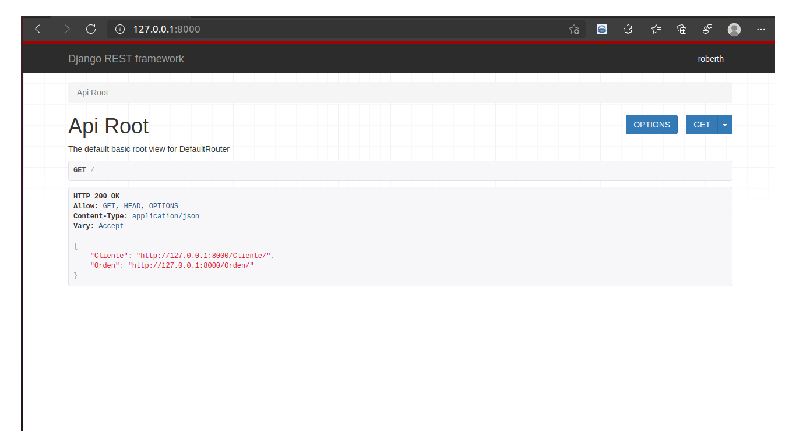

# Assessment to Web Developer

### Description of Requirements

#### <li>It must be possible to manage customers (Create, Edit, Delete, List).</li>
#### <li>You must be able to enter a glass order to a customer.</li>
#### <li>You must be able to approve an order.</li>
#### <li>It must be possible to cancel an order</li>
#### <li>The order can have several items or details, where the consecutive of the item, length and width of the glass is saved width of the glass.</li>


## APP Requirements Setup

```
$ pip3 install -r requirements.txt
```

## Run Locally

Clone the project

```bash
  https://github.com/RobARC/TEST-DEV.git
```

Go to the project directory

```bash
  cd TEST-DEV
```

Start database

```bash
  docker-compose up --build
```

Start the server

```bash
    python manage.py runserver
```
## Demo




