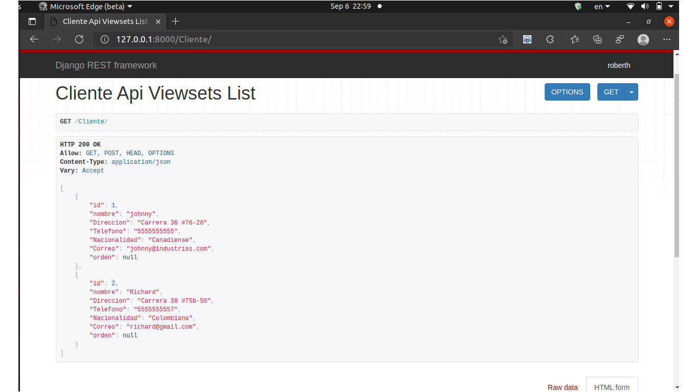
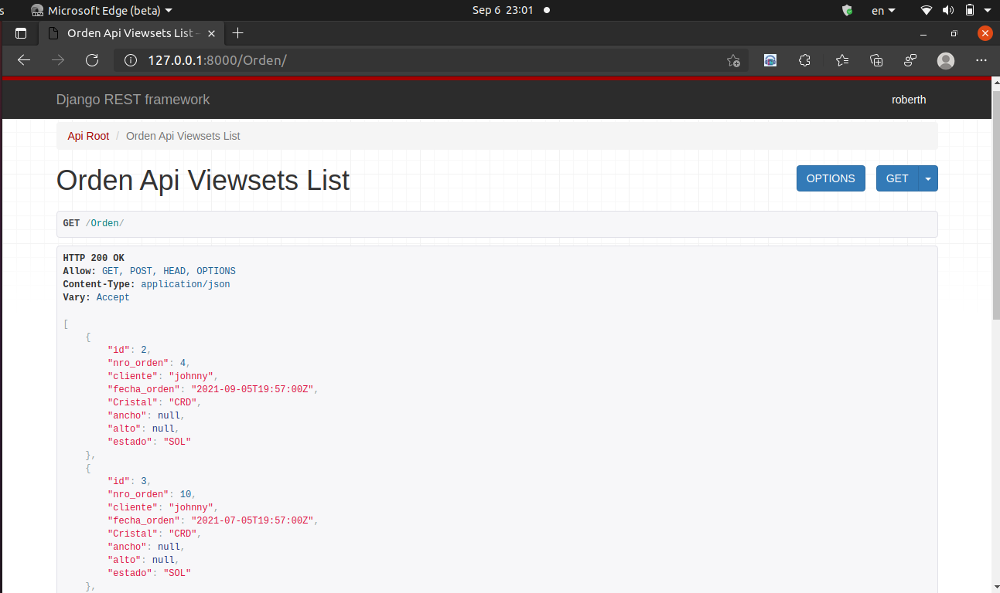
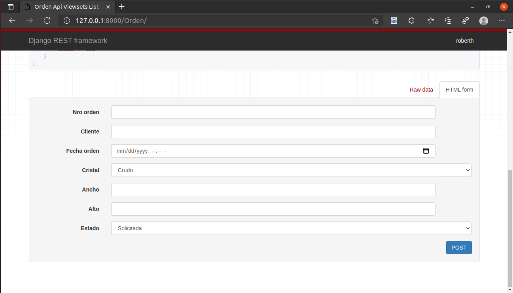

# Assessment to Web Developer

### Description of Requirements

#### <li>It must be possible to manage customers (Create, Edit, Delete, List).</li>
#### <li>You must be able to enter a glass order to a customer.</li>
#### <li>You must be able to approve an order.</li>
#### <li>It must be possible to cancel an order</li>
#### <li>The order can have several items or details, where the consecutive of the item, length and width of the glass is saved width of the glass.</li>


## APP Requirements Setup

### Install Docker

<b>Step 1) Install prerequisites packages for docker</b>
```
$ sudo apt update
```
```
$ sudo apt install -y apt-transport-https ca-certificates curl gnupg-agent software-properties-common
```
<b>Step 2) Setup docker official repository</b>
```
$ curl -fsSL https://download.docker.com/linux/ubuntu/gpg | sudo apt-key add -
```
```
$ sudo add-apt-repository \
"deb [arch=amd64] https://download.docker.com/linux/ubuntu \
```
```
$ (lsb_release -cs) stable"
```
<b>Step 3) Install docker with apt command</b>
```
$ sudo apt update
```
```
$ sudo apt install docker-ce -y
```
```
$ sudo usermod -aG docker pkumar
```

### Install Requirements

```
$ pip3 install -r requirements.txt
```

## Run Locally

Clone the project

```bash
  https://github.com/RobARC/TEST-DEV.git
```

Go to the project directory

```bash
  cd TEST-DEV
```

Start database

```bash
  docker-compose up --build
```

Start the server

```bash
    python manage.py runserver
```
## Demo

### API Reference

#### API Root local

```
    http://127.0.0.1:8000
```
```
    GET /
```
##### You can see the API Root


#### Get all Customers

```http
  GET /Cliente
```

| Parameter | Type     | Description                |
| :-------- | :------- | :------------------------- |
| `/Cliente` | `string` | **Required**. Your API key |



##### You can see Customer Form scroll down


### Get all Orders

```http
  GET /Orden
```

| Parameter | Type     | Description                |
| :-------- | :------- | :------------------------- |
| `/Orden` | `string` | **Required**. Your API key |

##### You can see all Orders


##### You can see Order Form


## Authors

- [@RobARC](https://www.github.com/RobARC)

  

